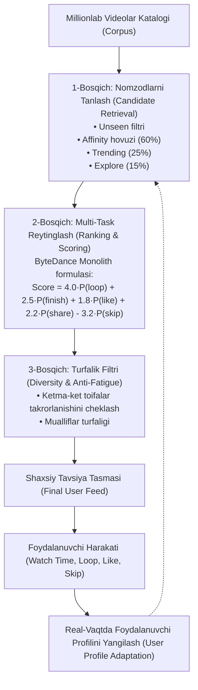

# 📱 TikTok / Reels Recommendation Algorithm v1 (From Scratch)

[](https://www.python.org/downloads/)
[]()
[-success.svg)]()
[]()

> **Dunyodagi eng mashhur zamonaviy mahsulotlarning v1 (MVP) arxitekturasini noldan yaratish seriyasi.**  
> Ushbu repozitoriy **TikTok (ByteDance)** va **Instagram Reels** ning global muvaffaqiyatiga sabab bo'lgan **Real-Time Interest Graph va Implicit Feedback** tavsiya dvigatelining noldan sof Python da qurilgan to'liq arxitekturasidir.

---

## 🧠 Nima uchun TikTok Dunyoni Zabt Etgan?

An'anaviy ijtimoiy tarmoqlar (Facebook, Twitter/X, eski Instagram) **Do'stlar grafigi (Social Graph)** ga tayanadi.  
TikTok esa **Qiziqishlar grafigi (Interest Graph)** va **Yashirin signallar (Implicit Feedback)** ni kashf qildi:

1. **Watch Time & Completion Rate**: Foydalanuvchi qaysi videoni qancha vaqt ko'rdi?
   - `0.1x - 0.25x` (Quick Skip): Kuchli salbiy signal — foydalanuvchi zerikdi.
   - `1.0x` (Full Completion): Ijobiy signal — video qiziq.
   - `> 1.25x` (Loop / Replay): **TikTok algoritmining eng qimmatli "Oltin signali"** — qayta ko'rilgan video eng yuqori koeffitsient oladi!
2. **Exploration vs Exploitation**: 80% tavsiyalar foydalanuvchi yoqtirgan toifadan berilsa, 20% yangi toifalar sinab ko'riladi (Multi-Armed Bandit).
3. **Diversity & Anti-Fatigue**: Bir xil mavzudagi yoki bitta muallifning videolari ketma-ket chiqib, foydalanuvchini charchatmasligi ta'minlanadi.

---

## 📐 3-Bosqichli Tavsiya Quvuri (3-Stage Pipeline)



---

## 📂 Loyiha Tuzilmasi

```
tiktok-reels-algorithm-v1/
├── reels_engine/
│   ├── models/
│   │   ├── video.py              # Video modeli, global metrikalar va sifat bali
│   │   └── interaction.py        # Watch ratio, loop, completion va skip telemetriyasi
│   ├── core/
│   │   ├── user_profile.py       # Real-vaqtdagi dinamik qiziqish vektori
│   │   ├── candidate_retrieval.py# 1-bosqich: Nomzodlar filtrlash hovuzi
│   │   ├── ranking.py            # 2-bosqich: Multi-task ehtimolliklar va ball berish
│   │   └── diversity.py          # 3-bosqich: Topic fatigue va turfalik filtri
│   └── feed_service.py           # To'liq xizmat orkestratori va katalog
├── tests/
│   ├── test_user_profile.py      # Profil adaptatsiyasi testlari
│   ├── test_ranking.py           # Reytinglash formulasi testlari
│   ├── test_diversity.py         # Turfalik va ketma-ketlik testlari
│   └── test_pipeline.py          # End-to-end to'liq quvur integratsiya testi
├── demo_simulation.py            # 3 xil foydalanuvchi (Dasturchi, Oshpaz, Avto) xulq-atvori simulyatsiyasi
├── cli_simulator.py              # Interaktiv terminal TikTok lentalari
├── requirements.txt              # Minimal test vositalari
└── README.md                     # Hujjatlar
```

---

## 🚀 Tezkor Ishga Tushirish

### 1. Testlarni Tekshirish (100% Yashil)
```bash
python -m pytest -v
```

### 2. 3 Xil Foydalanuvchi Simulyatsiyasini Ko'rish
Dasturchi, Oshpaz va Avto ishqibozi videolarni ko'rganda algoritm qanday qilib ularning didini 2-qadamdayoq tushunib olganini ko'rish uchun:
```bash
python demo_simulation.py
```

### 3. Interaktiv Terminal TikTok лентасини Ishga Tushirish
Haqiqiy foydalanuvchi sifatida videolarni ko'rish, layk bosish yoki o'tkazib yuborish orqali tilingizni sinab ko'ring:
```bash
python cli_simulator.py
```

---
**Muallif:** Javohirbek Asqarov (Jasper)  
*Modern v1 Engineering Architecture Series*
